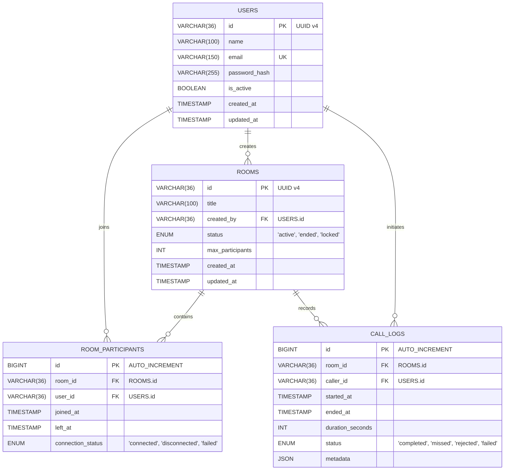

# Entity Relationship Diagram & MySQL Schema Specification

Dokumen ini mendefinisikan desain skema basis data MySQL 8.x untuk layanan WebRTC Signaling dan API Service.

---

## 1. Diagram Relasi Entitas (Mermaid ERD)



---

## 2. Struktur Tabel & DDL SQL (MySQL 8.x Engine InnoDB)

```sql
-- Pastikan database menggunakan UTF8MB4
CREATE DATABASE IF NOT EXISTS webrtc_service
  DEFAULT CHARACTER SET utf8mb4
  DEFAULT COLLATE utf8mb4_unicode_ci;

USE webrtc_service;

-- ==========================================================
-- 1. TABEL: users
-- ==========================================================
CREATE TABLE IF NOT EXISTS users (
    id VARCHAR(36) NOT NULL,
    name VARCHAR(100) NOT NULL,
    email VARCHAR(150) NOT NULL,
    password_hash VARCHAR(255) NOT NULL,
    is_active TINYINT(1) NOT NULL DEFAULT 1,
    created_at TIMESTAMP NOT NULL DEFAULT CURRENT_TIMESTAMP,
    updated_at TIMESTAMP NOT NULL DEFAULT CURRENT_TIMESTAMP ON UPDATE CURRENT_TIMESTAMP,
    PRIMARY KEY (id),
    UNIQUE KEY uq_users_email (email)
) ENGINE=InnoDB;

-- ==========================================================
-- 2. TABEL: rooms
-- ==========================================================
CREATE TABLE IF NOT EXISTS rooms (
    id VARCHAR(36) NOT NULL,
    title VARCHAR(100) NOT NULL,
    created_by VARCHAR(36) NOT NULL,
    status ENUM('active', 'ended', 'locked') NOT NULL DEFAULT 'active',
    max_participants INT UNSIGNED NOT NULL DEFAULT 2,
    created_at TIMESTAMP NOT NULL DEFAULT CURRENT_TIMESTAMP,
    updated_at TIMESTAMP NOT NULL DEFAULT CURRENT_TIMESTAMP ON UPDATE CURRENT_TIMESTAMP,
    PRIMARY KEY (id),
    KEY idx_rooms_created_by (created_by),
    KEY idx_rooms_status (status),
    CONSTRAINT fk_rooms_created_by FOREIGN KEY (created_by) REFERENCES users (id) ON DELETE CASCADE
) ENGINE=InnoDB;

-- ==========================================================
-- 3. TABEL: room_participants
-- ==========================================================
CREATE TABLE IF NOT EXISTS room_participants (
    id BIGINT UNSIGNED NOT NULL AUTO_INCREMENT,
    room_id VARCHAR(36) NOT NULL,
    user_id VARCHAR(36) NOT NULL,
    joined_at TIMESTAMP NOT NULL DEFAULT CURRENT_TIMESTAMP,
    left_at TIMESTAMP NULL DEFAULT NULL,
    connection_status ENUM('connected', 'disconnected', 'failed') NOT NULL DEFAULT 'connected',
    PRIMARY KEY (id),
    KEY idx_participants_room_id (room_id),
    KEY idx_participants_user_id (user_id),
    CONSTRAINT fk_participants_room_id FOREIGN KEY (room_id) REFERENCES rooms (id) ON DELETE CASCADE,
    CONSTRAINT fk_participants_user_id FOREIGN KEY (user_id) REFERENCES users (id) ON DELETE CASCADE
) ENGINE=InnoDB;

-- ==========================================================
-- 4. TABEL: call_logs
-- ==========================================================
CREATE TABLE IF NOT EXISTS call_logs (
    id BIGINT UNSIGNED NOT NULL AUTO_INCREMENT,
    room_id VARCHAR(36) NOT NULL,
    caller_id VARCHAR(36) NOT NULL,
    started_at TIMESTAMP NOT NULL DEFAULT CURRENT_TIMESTAMP,
    ended_at TIMESTAMP NULL DEFAULT NULL,
    duration_seconds INT UNSIGNED NOT NULL DEFAULT 0,
    status ENUM('completed', 'missed', 'rejected', 'failed') NOT NULL DEFAULT 'completed',
    metadata JSON NULL COMMENT 'Menyimpan statistik WebRTC, jitter, codec, resolusi',
    PRIMARY KEY (id),
    KEY idx_call_logs_room_id (room_id),
    KEY idx_call_logs_caller_id (caller_id),
    CONSTRAINT fk_call_logs_room_id FOREIGN KEY (room_id) REFERENCES rooms (id) ON DELETE CASCADE,
    CONSTRAINT fk_call_logs_caller_id FOREIGN KEY (caller_id) REFERENCES users (id) ON DELETE CASCADE
) ENGINE=InnoDB;
```

---

## 3. Strategi Indexing & Optimasi Query

1. **Pencarian Sesi Aktif:** Index pada kolom `rooms(status)` dan `room_participants(connection_status)` mempercepat pencarian room yang masih menampung user aktif.
2. **Kueri Riwayat Pengguna:** Index majemuk (composite index) dapat ditambahkan pada `call_logs(caller_id, started_at DESC)` jika sistem sering membaca riwayat panggilan terbaru per user.
3. **Penyimpanan Metrik WebRTC:** Kolom `metadata` di `call_logs` menggunakan tipe data `JSON` untuk menyimpan detail laporan kualitas koneksi (_packet loss_, _codec_, _bitrate_) tanpa perlu mengubah struktur tabel jika ada atribut baru.
